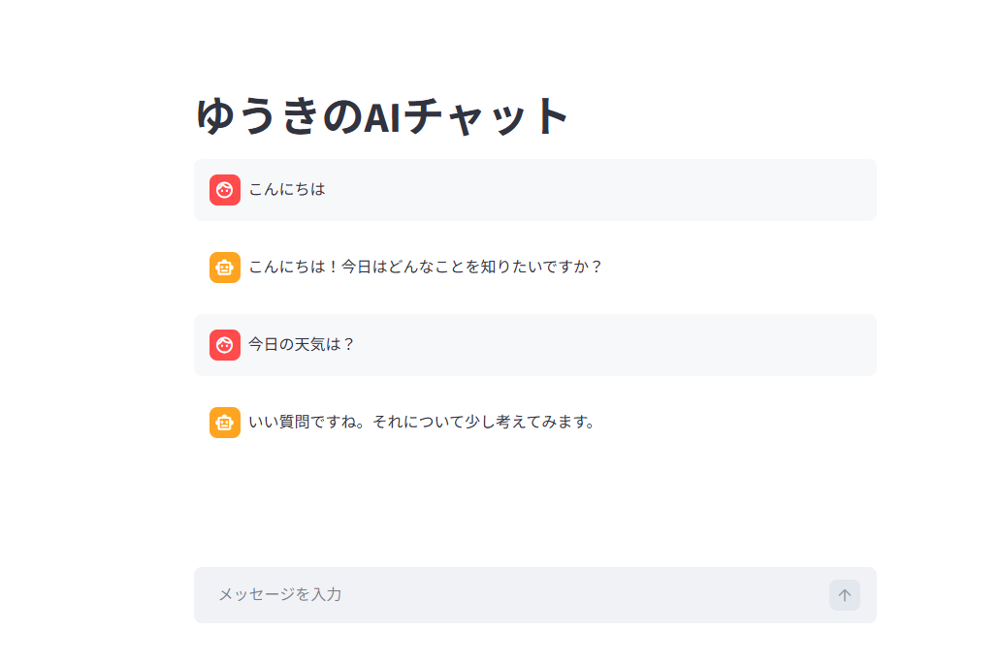

# ゆうきのAIチャット（Simple AI Chat）

Python と Streamlit を使って作成したシンプルな AI チャットアプリです。  
当初は外部 API を利用する予定でしたが、環境の都合で使用できなかったため、  
独自の返答ロジックを実装して対話システムを構築しました。

API に依存しない構成にしたことで、  
「入力の解釈 → 条件分岐 → 応答生成」という  
対話システムの基本的な仕組みを理解することに役立ちました。

---

## 🚀 機能概要

- ユーザーの入力に応じて返答を生成する簡易 AI  
- 挨拶・質問・感情ワードなどに応じて返答を切り替え  
- 会話履歴を保持してチャット形式で表示  
- Streamlit を使用したシンプルな Web UI  

---

## 💬 アプリ画面

このアプリは Streamlit を使って構築したチャットUIを採用しています。  
ユーザーが入力したメッセージに対して、AIが自然に返答する仕組みを実装しています。



---

## 🧠 技術ポイント

- **Python（クラス設計・文字列処理）**  
- **Streamlit によるチャット UI**  
- **session_state を使った会話履歴管理**  
- **ルールベースの返答ロジック（正規表現・条件分岐）**

---

## 🎯 開発の目的（面接向け）

外部 API が利用できない環境だったため、  
自分で返答ロジックを実装して AI チャットを構築しました。

その結果、  
- 対話システムの基本構造  
- 入力解析の考え方  
- 応答生成の仕組み  
を自分の手で理解する良い経験になりました。

---

## 🛠️ 使用技術

- Python 3.12  
- Streamlit  
- 正規表現（re）  
- session_state（会話管理）

---

## 📦 セットアップ

```bash
pip install -r requirements.txt
streamlit run app.py


